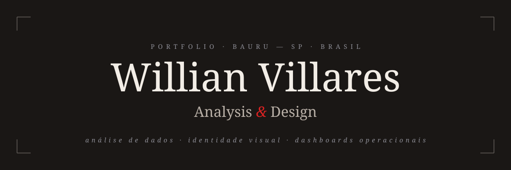

<div align="center">



<br>

[](https://willianvillares.com)
&nbsp;
[](https://www.linkedin.com/in/willian-villares)
&nbsp;
[](mailto:will.vills.ds.sants@hotmail.com)

<br>

<p>
Análise de dados &nbsp;·&nbsp; Design &nbsp;·&nbsp; Bauru — SP &nbsp;·&nbsp; Brasil<br>
SQL &nbsp;·&nbsp; BigQuery &nbsp;·&nbsp; Looker Studio &nbsp;·&nbsp; UI &nbsp;·&nbsp; Identidade Visual
</p>

</div>

---

## Sobre o Projeto

Portfólio profissional construído do zero, sem templates, sem CMS, sem framework. Apenas HTML, CSS e JavaScript puros, servidos de forma estática. Um espaço único para reunir currículo, projetos e posicionamento profissional num mesmo domínio.

O site nasceu da ideia de que um portfólio deveria ser um documento autoral por inteiro — da tipografia ao dado, da decisão visual à linha de código. Cada escolha aqui é uma pequena declaração sobre como se lê um problema e como se devolve uma solução.

---

## Posicionamento

Dados e design conversam mais do que parece. Um dashboard bem feito é desenho tipográfico. Uma identidade visual é uma forma de organizar informação. Ambos começam na mesma pergunta: **o que esta leitura precisa comunicar?** Este portfólio é a tentativa de mostrar as duas frentes sem separá-las em compartimentos estanques.

| | |
|---|---|
| **Dados** | Análise logística, supply chain, dashboards operacionais, automação de relatórios |
| **Design** | Identidade visual, UI, rebranding industrial, sistemas de design |
| **Base** | Bauru — SP, Brasil |
| **Disponibilidade** | Aberto a novas oportunidades, freelas e parcerias |

---

## Stack Técnica

| Camada | Tecnologia | Detalhe |
|---|---|---|
| **Frontend** | HTML · CSS · JavaScript | Vanilla, zero dependências de build |
| **Tipografia** | Bebas Neue · DM Sans · EB Garamond · Playfair Display | Google Fonts |
| **Ícones** | SVG inline e base64 | Favicon universal para Chrome, Brave, Edge e DuckDuckGo |
| **PWA** | Web App Manifest | Instalável com tema e ícones próprios |
| **SEO** | Schema.org JSON-LD · Open Graph · Twitter Card | Rich results para Google, Bing, DDG e Yandex |

---

## Funcionalidades do Portfólio

A página inicial abre com um loader tipográfico que apresenta a marca antes de revelar o hero com o nome completo e a linha de posicionamento "Design & Analysis". Logo abaixo, a seção de identidade expõe a relação entre dados e design, acompanhada de uma lista de stats e de um retrato editorial.

A seção **Minha atuação** apresenta os serviços em colunas temáticas, cada uma com tipografia própria e lista de entregáveis. O bloco **Trabalhos em destaque** abriga um modal dedicado ao Relatório Executivo Interativo, com galeria de telas, ficha técnica e descrição do escopo. Um segundo modal reúne a lista completa de projetos organizada por ano, com navegação por teclado.

A navegação desktop é fixa, semi-translúcida e se transforma conforme a rolagem. No mobile, o hamburger abre um overlay fullscreen com animação de entrada item a item. Todos os links internos usam smooth scroll com offset calculado para a altura da navbar. A marca se adapta automaticamente aos fundos claros e escuros de cada seção.

---

## SEO

Implementação completa de metadados para múltiplos buscadores e redes sociais: Open Graph com preview 1200×630, Twitter Card `summary_large_image`, canonical URL, hreflang `pt-BR`, metadados de idioma, coverage e geolocalização (`geo.region`, `geo.position`, `ICBM`).

Dados estruturados em JSON-LD seguindo o padrão Schema.org com cinco blocos aninhados: `Person`, `ProfilePage`, `WebSite` com `SearchAction`, `WebPage` e `BreadcrumbList`. Cada ocupação é descrita como `Occupation` individual, com `occupationLocation`, `description` e `skills` próprios.

O `robots.txt` libera os crawlers relevantes (Googlebot, Bingbot, Slurp/Yahoo, DuckDuckBot, Yandex, Baidu, Applebot, Naver, Seznam, Ecosia, Qwant) e agentes de IA autorizados (GPTBot, ClaudeBot, PerplexityBot, Google-Extended), bloqueando scrapers agressivos de SEO (AhrefsBot, SemrushBot, MJ12bot, DotBot, BLEXBot). O `sitemap.xml` inclui `hreflang`, preview Open Graph e frequência de atualização. PWA instalável via `site.webmanifest`.

---

## Estrutura do Repositório

```
/
├── index.html              site completo
├── css/
│   └── style.css           estilos extraídos
├── js/
│   ├── main.js             comportamento da página
│   └── favicon.js          injeção do favicon SVG universal
├── assets/
│   └── icons/              favicons em múltiplos formatos
├── banner.svg              banner do README
├── og-image.svg            preview para redes sociais (1200×630)
├── site.webmanifest        Web App Manifest (PWA)
├── robots.txt              regras de indexação por buscador
├── sitemap.xml             mapa do site
└── README.md
```

---

## Sobre

De dia, **analista de dados** com foco em logística, supply chain, automação de relatórios e dashboards operacionais. Em paralelo, **designer** de identidade visual e UI, com atuação em rebranding industrial e sistemas de design.

Este portfólio é o ponto onde as duas práticas se encontram. Cada seção foi pensada para mostrar que análise e desenho não são coisas separadas — são camadas de um mesmo modo de ler o mundo: observar, organizar e devolver em forma comunicável.

| | |
|---|---|
| **Dados** | SQL · BigQuery · Looker Studio · análise logística · supply chain |
| **Design** | Identidade visual · UI · rebranding · sistemas de design |
| **Ferramentas** | Figma · Google Data Studio · automação de relatórios |
| **Inteligência Artificial** | Entusiasta de automação, LLMs e ferramentas de IA aplicadas |

---

<div align="center">

```
entre a planilha e o traço
```

*Site desenvolvido com auxílio de inteligência artificial como parte de estudos e experimentos em desenvolvimento web. Todo o conceito, conteúdo e direção criativa são autorais.*

</div>
